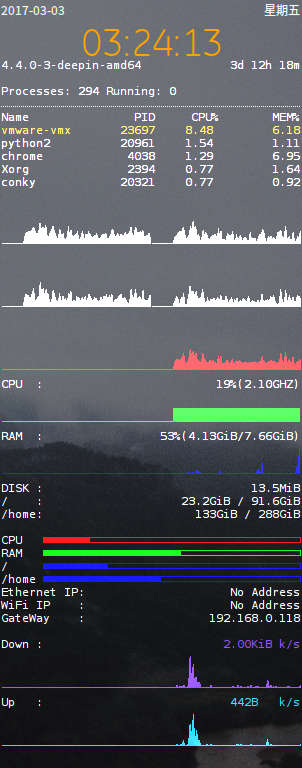

Conky configuration file

# Dependence

  `sudo apt-get install conky conky-all conky-manager`

# Usage

clone file `conkyrc` to `~/.conky/yexiaorain/conkyrc`

run `conky-manager`

and check it on in the **conky manager**

# Preview

